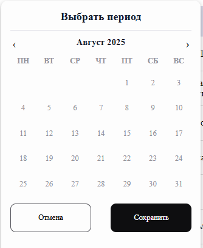
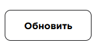
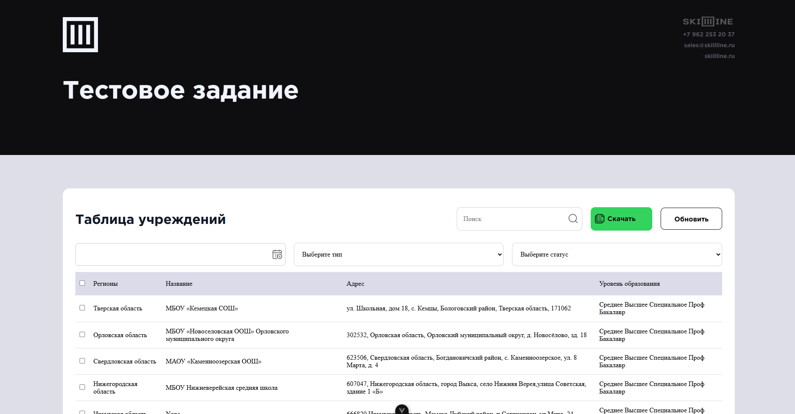
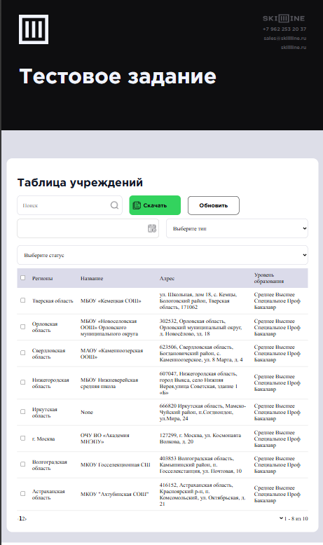

## Summary

## Зависимости Vue компонентов

В проекте используются следующие зависимости между Vue компонентами:

- **InstitutionTable.vue**
    - TableHeader.vue
    - TableBody.vue
    - SelectComponent.vue
    - DateRangeInput.vue
- **TableHeader.vue**
    - DownloadButton.vue
    - Input.vue
- **DateRangeInput.vue**
    - CalendarPicker.vue

Был добавлен компонент ( elements ):

`Из апдейтов бы сделал InstitutionTable.vue зависимым от пропсов таких как: апи и поля, что делается довольно незамысловато, но последние 3 дня у меня лихорадка. Внезапно.
`

`Время на тестовое и так превысило несколько дней из-за перехода с React, поэтому ui-kit оже в апдейтах
`

Ручками потыкал другие браузеры, проблем не было. 

## Адаптив

